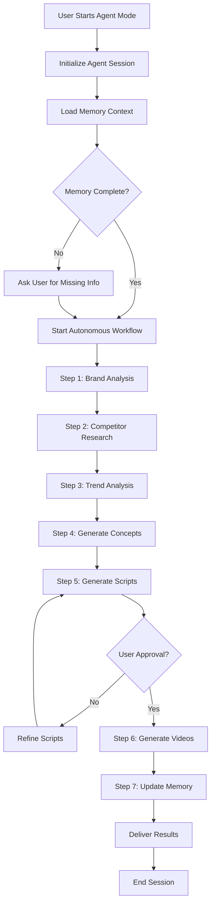
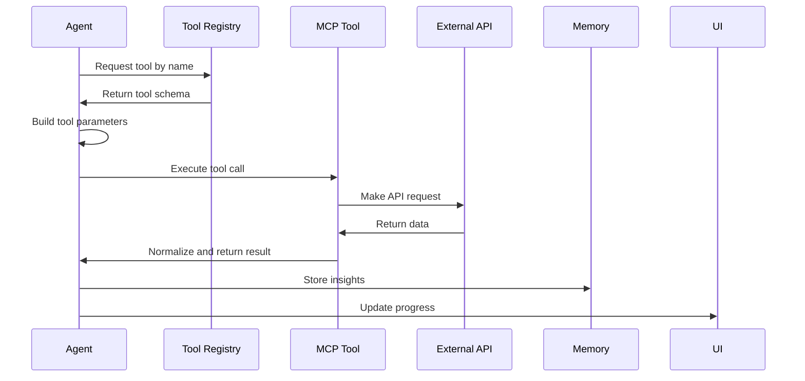

# Agent Mode Architecture

## 1. High-Level Agent Graph Flow



## 2. Reasoning Loop Design

### Agent Reasoning Cycle

```typescript
interface ReasoningCycle {
  step: string;
  objective: string;
  contextNeeded: string[];
  toolsAvailable: string[];
  reasoning: string;
  decision: string;
  nextStep: string;
}
```

### Reasoning Process

1. **Observe**: Gather current state (memory, user input, previous step results)
2. **Orient**: Analyze what's needed to achieve the objective
3. **Decide**: Choose best tool/action based on confidence score
4. **Act**: Execute tool or ask user
5. **Reflect**: Evaluate result quality and update confidence
6. **Loop**: Proceed to next step or retry

### Confidence Thresholds

- **> 90%**: Proceed autonomously, no logging needed
- **80-90%**: Proceed autonomously, log decision for review
- **60-80%**: Proceed with caution, flag for user review later
- **< 60%**: Ask user for clarification before proceeding

## 3. Autonomy Rules

### Memory-First Decision Making

```typescript
async function makeDecision(objective: string): Promise<Action> {
  // 1. Check memory for similar past decisions
  const memoryResults = await searchMemory(objective);
  
  if (memoryResults.confidence > 0.8) {
    return { type: 'autonomous', action: memoryResults.recommendation };
  }
  
  // 2. Infer from context
  const contextInference = await inferFromContext(objective);
  
  if (contextInference.confidence > 0.8) {
    return { type: 'autonomous', action: contextInference.recommendation };
  }
  
  // 3. Ask user
  return { type: 'ask_user', question: contextInference.question };
}
```

### Autonomous Decisions (No User Input)

- Selecting hooks from competitor research
- Choosing video format based on brand guidelines
- Determining script length based on platform
- Selecting actors based on brand demographics
- Choosing music/tone from brand voice
- Setting video parameters (aspect ratio, duration)

### User Confirmation Required

- Approving final scripts before video generation
- Confirming budget spend if over threshold
- Resolving contradictory brand guidelines
- Choosing between equally-weighted options
- Approving first-time actions (one-time setup)

## 4. MCP Tool Execution Cycle

### Tool Call Workflow



### Tool Execution Rules

- **Timeout**: 30 seconds per tool call
- **Retries**: 3 attempts with exponential backoff
- **Fallback**: If tool fails, log error and ask user or skip step
- **Rate Limiting**: Respect tool-specific rate limits
- **Caching**: Cache tool results for 1 hour (where appropriate)

### Tool Priority Order

1. **Memory Search** (always first)
2. **Meta Ads Library** (if researching competitors)
3. **TikTok Creative Center** (for trends)
4. **YouTube Ads Insights** (for video formats)
5. **Video Analysis** (for existing video analysis)
6. **Screenshot Tool** (for visual reference)
7. **Whisper** (for transcription)
8. **Sora 2** (for video generation)

## 5. Error Recovery and Fallback

### Error Types and Handling

| Error Type | Recovery Strategy | Fallback |
|-----------|------------------|----------|
| Tool timeout | Retry 3x with exponential backoff | Skip step, proceed with partial data |
| API rate limit | Wait and retry | Use cached data or ask user |
| Invalid API response | Log error, retry once | Skip tool, use memory inference |
| Memory search fails | Use defaults from PRD | Ask user for preferences |
| Sora 2 generation fails | Retry with simplified prompt | Fallback to existing video gen |
| User doesn't respond | Wait 2 minutes, then proceed with best guess | Log assumption for review |

### Graceful Degradation

- If competitor research fails → use general best practices from memory
- If trend analysis fails → use evergreen formats
- If video generation fails → deliver scripts and research report only
- If memory unavailable → operate in stateless mode with user input

### Critical Failures (Cannot Recover)

- Authentication failure
- Supabase connection lost
- All tools unavailable
- User explicitly cancels

**Action**: Save partial progress, notify user, allow resume later.

## 6. Tool Access Sequence

### Step-by-Step Tool Usage

#### Step 1: Brand Analysis
- **Tool**: Memory search (brand_memory table)
- **Output**: Brand voice, ICP, messaging, past performance
- **Fallback**: Ask user for brand guidelines

#### Step 2: Competitor Research
- **Tools**: Meta Ads Library MCP → TikTok Creative Center MCP → YouTube Ads Insights MCP
- **Parallel Execution**: Yes (all 3 simultaneously)
- **Output**: Top 50 competitor ads with hooks, CTAs, formats
- **Fallback**: Use generic ad formats

#### Step 3: Trend Analysis
- **Tool**: TikTok Creative Center Trends MCP
- **Output**: Trending audio, hashtags, video formats
- **Fallback**: Use evergreen formats

#### Step 4: Video Analysis (Optional)
- **Tool**: Video Analysis MCP (if user provides reference video)
- **Output**: Video structure, pacing, hooks, CTAs
- **Fallback**: Skip this step

#### Step 5: Generate Concepts
- **Tool**: LLM (via Lovable AI Gateway)
- **Input**: Brand memory + competitor research + trends
- **Output**: 5 video concepts with hooks, angles, CTAs
- **Fallback**: Use templates from memory

#### Step 6: Generate Scripts
- **Tool**: LLM (via Lovable AI Gateway)
- **Input**: Selected concept + brand voice
- **Output**: Full video script with shot list
- **Fallback**: Use script templates

#### Step 7: Generate Videos
- **Tool**: Sora 2 API (multi-step prompts)
- **Input**: Script + shot list + brand visuals
- **Output**: 8-second clips → stitched into final video
- **Fallback**: Use existing Omnihuman generation

#### Step 8: Update Memory
- **Tool**: Memory write (embedding model + Supabase)
- **Input**: Insights, performance data, user feedback
- **Output**: Updated vector embeddings
- **Fallback**: Log data for batch update later

## 7. Agent Memory Read/Write Flow

### Memory Read (Query)

```typescript
async function readMemory(query: string, type: MemoryType): Promise<MemoryResult[]> {
  // 1. Generate embedding for query
  const embedding = await generateEmbedding(query);
  
  // 2. Vector search in Supabase
  const results = await supabase.rpc('match_memory', {
    query_embedding: embedding,
    match_threshold: 0.7,
    match_count: 5,
    memory_type: type
  });
  
  // 3. Return ranked results
  return results.data;
}
```

### Memory Write (Store)

```typescript
async function writeMemory(content: string, metadata: MemoryMetadata): Promise<void> {
  // 1. Generate embedding
  const embedding = await generateEmbedding(content);
  
  // 2. Insert into Supabase with RLS
  await supabase.from('agent_memory').insert({
    user_id: metadata.userId,
    memory_type: metadata.type,
    content: content,
    embedding: embedding,
    metadata: metadata,
    created_at: new Date()
  });
  
  // 3. Trigger realtime update
  await supabase.channel('agent-memory').send({
    type: 'memory_updated',
    payload: { type: metadata.type }
  });
}
```

### Memory Types

1. **Brand Memory**: Voice, messaging, ICP, brand guidelines
2. **User Preferences**: Preferred formats, actors, music, tone
3. **Competitive Memory**: Competitor strategies, winning hooks, successful formats
4. **Task Memory**: Past agent runs, decisions made, outcomes
5. **Performance Memory**: Video performance metrics, A/B test results

### Memory Lifecycle

- **Creation**: Automatically created during agent runs and user interactions
- **Update**: Embeddings regenerated when content changes
- **Expiration**: Task memory expires after 90 days; other types never expire
- **Deletion**: User can delete via settings; RLS ensures isolation

## 8. Agent State Management

### State Transitions

```typescript
enum AgentState {
  IDLE = 'idle',
  INITIALIZING = 'initializing',
  ANALYZING_BRAND = 'analyzing_brand',
  RESEARCHING_COMPETITORS = 'researching_competitors',
  ANALYZING_TRENDS = 'analyzing_trends',
  GENERATING_CONCEPTS = 'generating_concepts',
  GENERATING_SCRIPTS = 'generating_scripts',
  AWAITING_APPROVAL = 'awaiting_approval',
  GENERATING_VIDEOS = 'generating_videos',
  UPDATING_MEMORY = 'updating_memory',
  COMPLETED = 'completed',
  ERROR = 'error',
  CANCELLED = 'cancelled'
}
```

### State Persistence

- State stored in Supabase table: `agent_sessions`
- Real-time updates via Supabase Realtime
- UI subscribes to state changes and updates progress bar
- State includes: current step, completed steps, current tool, progress percentage

## 9. Performance Optimization

### Parallelization Strategy

- Run all competitor research tools in parallel (Meta, TikTok, YouTube)
- Generate multiple embeddings in batch
- Pre-fetch memory while tool is executing
- Stream LLM responses for faster perceived performance

### Caching Strategy

- Cache tool results for 1 hour (configurable)
- Cache embeddings for frequently-used queries
- Cache brand memory in local storage (encrypted)

### Rate Limiting

- Respect tool-specific rate limits
- Implement exponential backoff for retries
- Queue requests if rate limit exceeded
- Notify user if delay > 1 minute

## 10. Security and Privacy

### RLS (Row-Level Security)

- All memory tables use RLS to isolate user data
- Agent sessions scoped to user_id
- Tool results never shared across users
- Admin access requires explicit admin role

### Data Sanitization

- Remove PII before logging
- Sanitize tool responses before storage
- Encrypt sensitive memory (API keys, credentials)
- Audit logs for all data access

### User Control

- User can delete all memory at any time
- User can export memory as JSON
- User can disable agent mode entirely
- User can review all agent decisions post-run
